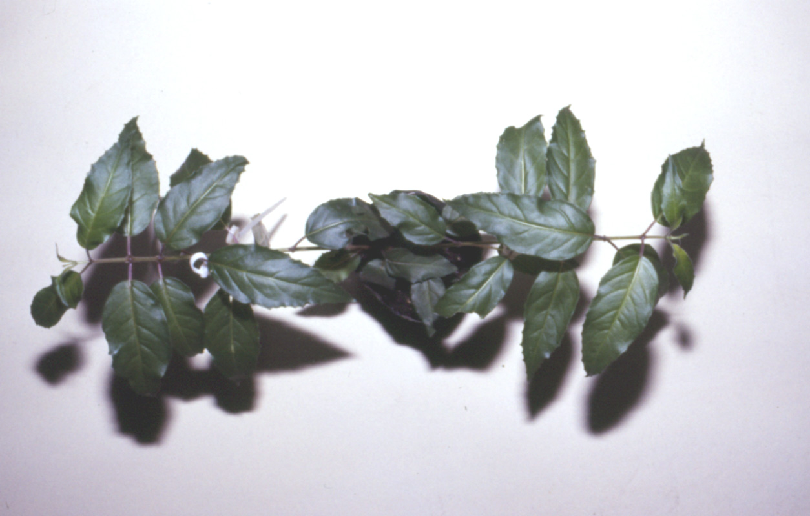
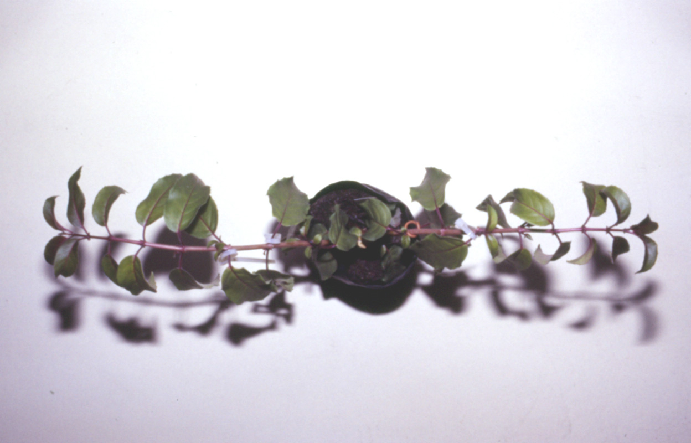
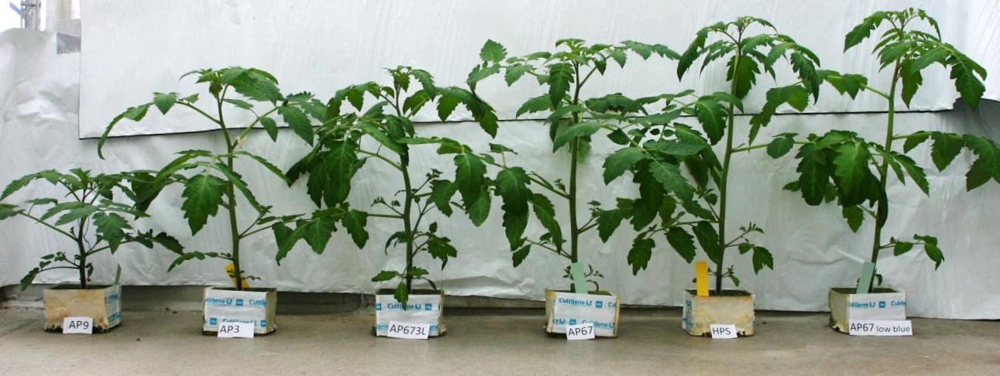
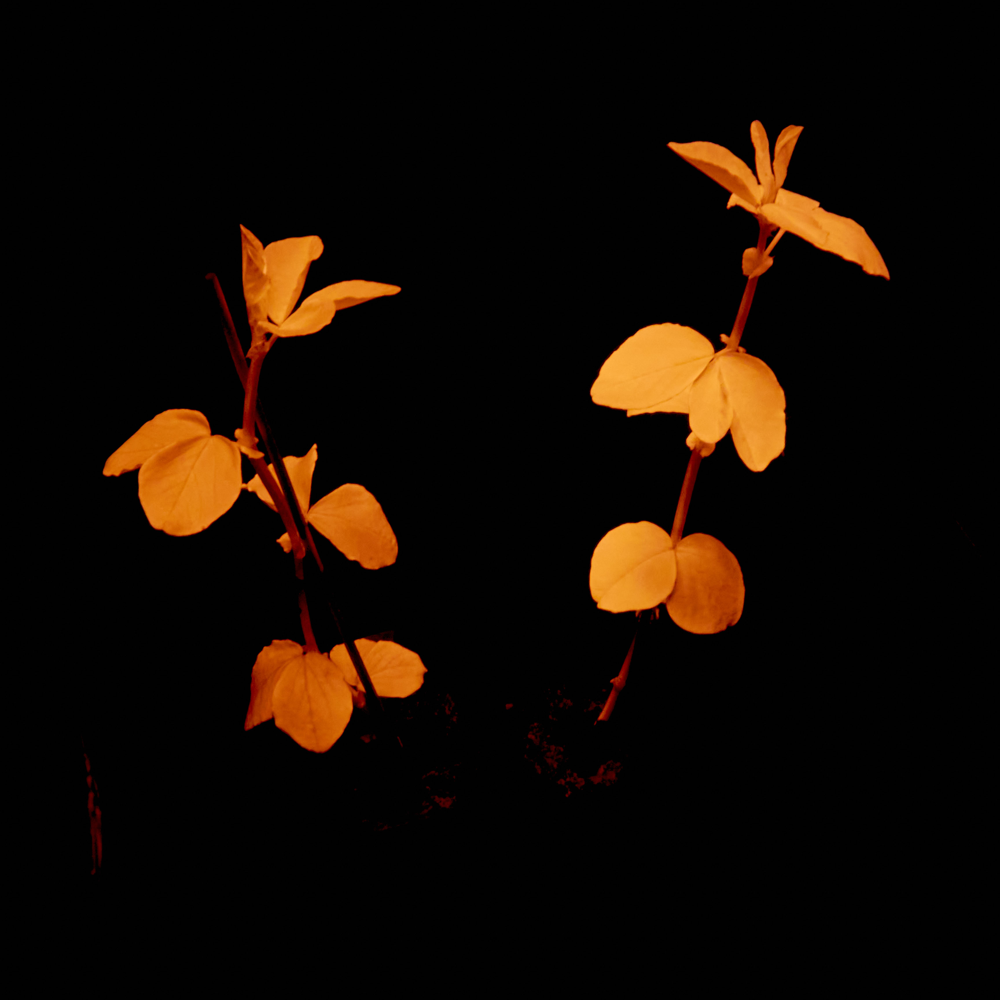

```{r, include=FALSE}
library(lubridate)
library(ggspectra)
library(ggpp)
library(ggrepel)
library(gganimate)
library(patchwork)
library(legendry)
library(photobiologyWavebands)
library(photobiologySun)
library(photobiologyPlants)
library(photobiologyLamps)
library(photobiologyLEDs)

theme_set(theme_minimal(14))
photon_as_default()
```

# Plants and Light

## Plant-Light Interactions

```{mermaid}
flowchart LR
L((Light)) --> Ph[Photoreceptors<br/> _very low concentration_]
Ph --> In[Information] --> Rg[[Regulation<br/>photomorphogenesis]]
L --> Sc[Screening pigments<br/> _variable concentration_] 
Sc --> Ed[Energy dissipation] --> Pr[[Protection<br/>from damage]]
L --> Lh[Light-harvesting pigments<br/> _high concentration_] 
Lh --> Ps[Photosynthesis =<br/>Energy conversion] --> Gr[[Biomass<br/>plant growth]]

```

## Intercepted Light Drives Growth

::: {#fig-fuchsia layout-ncol=2}





Size and position of leaves depends on growing conditions. In low light (_A_) large thin leaves are displayed horizontally. In high light (_B_) small thick leaves are displayed almost vertically. 

:::

## Light Colour Regulates Growth



## Light Actions 

```{r, echo=FALSE, fig.asp=0.54, fig.width= 6}
#| label: fig-photoreceptors
#| fig-cap: Range of wavelengths sensed through different higher-plant photoreceptor families (black "information acquisition") or driving photoreactions (orange "energy dependent"). DNA damage and repair, photosynthesis and photoreceptors; CRY&#58; cryptochromes 1 and 2, PHOT&#58; phototropins 1 and 2, ZTL&#58; Zeitlupe, UVR8&#58; "UV-B" photoreceptor, PHY&#58; phytochromes A/B/C/D/E.

photoreceptors.df <- data.frame(
  Receptor = factor(c("UVR8", "PHOT", "CRY", "ZTL", "PHY", "PHY", "Photosynthesis", "DNA repair", "DNA damage"), 
  levels = c("UVR8", "ZTL", "PHOT", "CRY", "PHY", "Photosynthesis", "DNA repair", "DNA damage")),
  low.wl = c(260, 360, 350, 350, 590, NA, 400, 355, 250),
  high.wl = c(340, 480, 500, 410, 780, NA, 700, 430, 315),
  min.wl = c(250, 340, 320, 340, 560, 350, 370, 320, 250),
  max.wl = c(345, 500, 600, 490, 790, 480, 750, 450, 330)
)

phoreceptors.fig <-
  ggplot(photoreceptors.df, aes(y = Receptor)) +
  geom_vline(xintercept = 293, linetype = "dashed") +
  geom_segment(aes(x = low.wl, xend= high.wl, 
                   colour = ifelse(Receptor %in% c("Photosynthesis", "DNA damage", "DNA repair"), "orange", "black")), 
               linewidth = 5, na.rm = TRUE) +
  geom_segment(aes(x = min.wl, xend= max.wl, 
                   colour = ifelse(Receptor %in% c("Photosynthesis", "DNA damage", "DNA repair"), "orange", "black")), linewidth = 3, alpha = 0.4) +
  scale_x_continuous(name = "Wavelength (nm)", 
                     breaks = (1:9) * 100) +
  labs(y = "Photoreceptors    Reactions") +
  scale_color_identity() +
  theme_minimal()

ranges <- key_range_manual(
  start = c("UVR8", "Photosynthesis"),
  end   = c("PHY", "DNA damage"), 
  name  = c("Information", "Energy"), 
  level = 1
)

phoreceptors.fig + guides(y.sec = primitive_bracket(ranges, bracket = "square", angle = 90))
```

## Light Screening and Absorption

```{r, echo=FALSE, fig.asp=0.54, fig.width= 6}
#| label: fig-pigments-leaves
#| fig-cap: Optical properties of leaves (olive), screening pigments (brown) and photosynthetic pigments (green). Thick lines indicate high absorption and paler narrower lines moderate absorption by pigments, or absorptance or reflectance plus transmittance for whole leaves. 

pigments.df <- data.frame(
  Pigment = factor(c("Chlorophylls", "Chlorophylls", "Carotenoids", "Flavonols", "Phenolic acids", "Anthocyanins", "Leaf reflectance\nand transmittance", "Leaf absorptance"), 
  levels = c("Chlorophylls", "Carotenoids", "Flavonols", "Phenolic acids", "Anthocyanins", "Leaf reflectance\nand transmittance", "Leaf absorptance")),
  low.wl = c(380, 600, 400, 340, 280, 470, 750, 250),
  high.wl = c(460, 680, 475, 380, 350, 560, 900, 705),
  min.wl = c(300, NA, 375, 250, 250, 320, 250, 250),
  max.wl = c(700, NA, 480, 400, 370, 590, 900, 750),
  colour = c(rep("forestgreen", 3), rep("brown", 3), rep("darkolivegreen", 2))
)

pigments.fig <-
  ggplot(pigments.df, aes(y = Pigment)) +
  geom_vline(xintercept = 293, linetype = "dashed") +
  geom_segment(aes(x = low.wl, xend= high.wl, colour = colour), 
               linewidth = 5, na.rm = TRUE) +
  geom_segment(aes(x = min.wl, xend= max.wl, colour = colour), 
               linewidth = 3, alpha = 0.4, na.rm = TRUE) +
  scale_x_continuous(name = "Wavelength (nm)", 
                     breaks = (1:9) * 100) +
  labs(y = "\"Mass\" pigments        Leaf") +
  scale_color_identity() +
  theme_minimal()

metabolite.ranges <- key_range_manual(
  start = c("Flavonols", "Chlorophylls"),
  end   = c("Anthocyanins", "Carotenoids"), 
  name  = c("Protection", "Photosynthesis"), 
  level = 1
)

optics.ranges <- key_range_manual(
  start = c(250, 720),
  end   = c(705, 900), 
  name  = c("Absorption", "Scattering"), 
  level = 1
)

pigments.fig + 
  guides(y.sec = primitive_bracket(metabolite.ranges, bracket = "square", angle = 90),
         x.sec = primitive_bracket(optics.ranges, bracket = "square"))

```

## Energy flow: electricity to produce {.scrollable}

```{mermaid}
flowchart TB
E(**Electricity**) ==> LED([LED + driver])
LED == 30 to 50% ==> L([Light<br/>_irradiance and spectrum_*])
LED -- 50 to 70% --> H[[Heat]]
L == 1 to 100% ==> IL[Intercepted by leaves<br/>_leaf area index or LAI by imaging_*]
L -- 100 to 1% --> NIL[Not intercepted by leaves<br/>_reaches soil, pots, shelves..._] 
NIL -- 100% --> WSA[Absorbed by objects] --> Hobj[[Heat]]
IL == 70 to 90% (LEDs) ===> Ab[Absorbed] 
IL -- 5 to 20% (LEDs) --> Rfl[[Reflected<br/>_imaging_*]]
IL -- 2 to 15% (LEDs) --> Tfr[[Transmitted<br/>_imaging?_*]]
Ab ==> Ph[Photosynthesis] == 2 to 5%<br/>of absorbed ==> Ch([Chemical energy<br/>_metabolites_])
Ab --> Fl[[Light<br/>_fluorescence_*]]
Ab --> He[Heat] --> Tleaf([_temperature of leaves_*])
Tleaf <--> Cv[[Convection<br/>_cooling or warming_]]
Tleaf --> Tr[[Transpiration<br/>_cooling_]]
Tr -- water use --> Sw([Soil water<br/>_pot weight_*]) 
Ch == 0 to 70% (?) ==> Gr[Growth<br/>_plant size and shape_*]
Ch -- 100 to 30% (?) --> Mn[[Maintenance<br/>_defence and repair_]]
Cv <--> Tair([Air temperature*])
Tr <--> Hair([Air water vapour*])
Tleaf <--> Thr[[Thermal radiation<br/>_cooling or warming_]]
Gr == ?% ==> Hv[[**Harvested**<br/>**produce**]]
Gr -- ?% --> Wst[[Waste]]

```

## Photosynthesis-related Spectra

::: {.panel-tabset}
### Chlorophyll _a_

```{r}
#| label: fig-chlorophyll-a-spct
#| fig-cap: Light absorption spectrum of chlorophyll _a_ in solution (DME).

autoplot(chlorophylls.mspct[grepl("Chl_a_DME", names(chlorophylls.mspct))], 
         plot.qty = "absorbance", span = 101, range = c(360, NA),
         annotations = c("+", "peak.labels"), geom = "spct") +
  expand_limits(x = 850)
```

### Chlorophyll _b_

```{r}
#| label: fig-chlorophyll-b-spct
#| fig-cap: Light absorption spectrum of chlorophyll _b_ in solution (DME).

autoplot(chlorophylls.mspct[grepl("Chl_b_DME", names(chlorophylls.mspct))], 
         plot.qty = "absorbance", span = 101, range = c(360, NA),
         annotations = c("+", "peak.labels"), geom = "spct") +
  expand_limits(x = 850)
```

### Carotene

```{r}
#| label: fig-carotene-spct
#| fig-cap: Light absorption spectrum of beta-carotene in solution.

autoplot(carotenoids.mspct$beta_carotene, 
         plot.qty = "absorbance", span = 21, range = c(360, NA),
         annotations = c("+", "peak.labels", "wls.labels"), geom = "spct") +
  expand_limits(x = 850)
```

### Leaf

```{r}
#| label: fig-leaf-spct
#| fig-cap: Spectral optical properties of the upper surface of a leaf of Arabidopsis.

autoplot(Ler_leaf.spct, plot.qty = "absorptance", 
         annotations = c("+", "valley.labels", "peak.labels", "wls.labels"),
         range = c(360, NA),
         geom = "spct", pc.out = TRUE, span = 501)
```

### Photosynthesis

```{r}
#| label: fig-photosynthesis-spct
#| fig-cap: Monochromatic action spectrum of oats' photosynthesis.

autoplot(McCree_photosynthesis.mspct["oats"], span = 21, range = c(350, NA),
         annotations = c("+", "peak.labels", "valley.labels", "wls.labels"),
         geom = "spct", pc.out = TRUE) + expand_limits(x = c(350, 850))
```

:::

## Morphology is Plastic

* _Starting with a given amount of "building blocks" (sugars + minerals)_ "plants' growth-regulation decisions" involve:
* grow big roots and small shoots, or vice versa,
* make large thin leaves or smaller thick leaves,
* continue making only leaves, or start making "fruits",
* grow tall to avoid shade from neighbours or stay low and tolerate the shade.

## Growth Depends on Morphology

* A larger surface of leaves intercepts more light driving a faster growth rate (similar to compound interest), but to a point.
* Larger/longer roots have access to more water and minerals allowing building new leaves, so a balance is needed.
* What is a good balance depends on light irradiance and soil conditions.

* "Decisions by the plant" are based to a significant extent on the colour of light, because in nature the colour of light informs about _future_ shade.

## Return on Investment


# The Light Environment

## Sunlight

```{r, include=FALSE}
# prepare data
sun_one_day.spct <- sun_hourly_august.spct
sun_one_day.spct <- subset(sun_one_day.spct, day(UTC) == 21)
sun_one_day.spct <- setIdFactor(sun_one_day.spct, idfactor = "UTC")
idfactor <- getIdFactor(sun_one_day.spct)
sun_one_day.spct[["time"]] <- sun_one_day.spct[[idfactor]]
sun_one_day.spct[[idfactor]] <- factor(sun_one_day.spct[[idfactor]])
```

::: {.panel-tabset}
### Irradiance

```{r, echo=FALSE}
#| label: fig-PAR-four-days
#| fig-asp: 0.45
#| fig-cap: Time course of PAR photon irradiance during four consecutive days with different cloud conditions. Measured with broad band-sensors at Viikki, Helsinki, Finland.

ggplot(four_days_1min.data, aes(time_EET, PAR_umol)) +
  geom_spct() +
    annotate(geom = "text_npc", label = "PAR", npcy = 0.95, npcx = 0.05) +
    labs(x = "Local time", y = expression("Photon irradiance "*(mu*mol~m^{-2}~s^{-1})))
```

### Spectrum

```{r, echo=FALSE, warning=FALSE}
#| label: fig-spectra-whole-day-anim
#| fig-asp: 0.4
#| fig-cap: Time series of scaled spectral photon irradiance during one day. Spectra scaled to $Q_{\lambda 400..700 nm} = 1000 \mu mol\,s^{-1}\,m^{-2}$. Computed by Andes Lindfors with Libradtran.

anim <- ggplot(data = fscale(sun_one_day.spct, f = q_irrad, target = 1e-3, w.band = PAR()),
               unit.out = "photon") +
  stat_wl_strip(ymax = 0, ymin = -0.03, by.group = TRUE) +
  geom_spct() +
  scale_x_wl_continuous() +
  scale_y_s.q.irrad_continuous(name = s.q.irrad_label(scaled = TRUE)) +
  scale_fill_identity() +
  transition_states(UTC,
                    transition_length = 2,
                    state_length = 1) +
  ggtitle('At {closest_state} UTC')
animate(anim, duration = 15, fps = 10)
```

:::

## Plants' shade

::: {.panel-tabset}
### Beech (dense)

```{r, warning=FALSE}
#| label: fig-beech-shade
#| fig-asp: 0.4
#| fig-cap: Light spectrum under a dense grove of young beech trees and in the open next to it.
#| out-width: '100%'
# load("data/collection-beech-shade-sun-BIO301.Rda")
# beech_shade.mspct <- collection.xx.irrad.mspct
# save(beech_shade.mspct, file = "data/beech-shade-mspct.rda")
load("data/beech-shade-mspct.rda")

for (i in seq_along(beech_shade.mspct)) {
  beech_shade.mspct[[i]][["rfr.rat"]] <- R_FR(beech_shade.mspct[[i]])
  beech_shade.mspct[[i]][["shade"]] <- ifelse(beech_shade.mspct[[i]][["rfr.rat"]] < 0.7,
                                              "Under trees", "In the open")
}
# rfr_ratio.df <- R_FR(beech_shade.mspct)

beech_shade.spct <- rbindspct(beech_shade.mspct)
autoplot(beech_shade.spct, annotations = c("-", "peaks")) +
  facet_wrap(facets = vars(shade)) +
  theme_bw() + 
  theme(legend.position = "none")
```
:::

## Artificial light for plant cultivation

::: {.panel-tabset}
### Grow lights (luminaires)

```{r}
#| label: fig-grow-lights
#| fig-asp: 0.45
#| fig-cap: Spectra of four contrasting LED grow lights.
#| out-width: '100%'
autoplot(lamps.mspct[plant_grow_lamps[1:4]], 
         range = c(350, 900), span = 31,
         geom = "spct",
         annotations = list(c("-", "summaries", "labels", "boxes"),
                            c("+", "peak.labels")), 
         facets = 2) + 
  theme_bw() + 
  theme(legend.position = "none")
```

### Grow LEDs (components)

```{r}
#| label: fig-grow-leds
#| fig-asp: 0.45
#| fig-cap: Spectra of four contrasting LEDs sold for grow lights.
#| out-width: '100%'
autoplot(leds.mspct[plant_grow_leds[c(1,2, 3, 5)]], 
         range = c(350, 900), span = 31,
         geom = "spct",
         annotations = list(c("-", "summaries", "labels", "boxes"),
                            c("+", "peak.labels")), 
         facets = 2) +
  theme_bw() + 
  theme(legend.position = "none")
```

:::

## Chlorophyll fluorescence

{width=50%}


